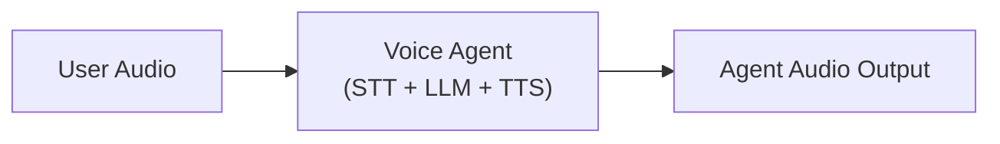
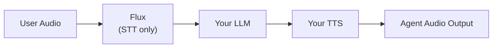

Flux tackles the most critical challenges for voice agents today: knowing when to listen, when to think, and when to speak. The model features first-of-its-kind model-integrated end-of-turn detection, configurable turn-taking dynamics, and ultra-low latency optimized for voice agent pipelines, all with Nova-3 level accuracy.

<Info>
  If you'd prefer to skip building, managing, and scaling a voice agent yourself -- explore our [Voice Agent API](/docs/voice-agent).
</Info>

## Let's Build!

This guide walks you through building a basic voice agent powered by Deepgram Flux, OpenAI, and Deepgram TTS—streaming speech-to-text with advanced turn detection—to create natural, real-time conversations with users.

By the end of this guide, you’ll have:

- A real-time voice agent with sub-second response times
- A voice agent that uses a static audio file for mocking out a conversation
- Natural conversation flow with Flux’s advanced turn detection model
- Voice Activity Detection based interruption handling for responsive interactions
- A complete setup ready for a demo deployment


## Choosing an LLM

Flux supports the use of any LLM you wish to use. So you can use the best LLM for your use case. For this demo we'll be using OpenAI.

## Voice Agent Patterns

<Info>
For this demo will opt to use `EndOfTurn` only for simplicity.
</Info>

Flux enables two voice agent patterns. You can decide which one to use based on your latency vs complexity/cost tradeoffs.

### `EndOfTurn` Only

**Considerations:**

| Factor | Details |
|--------|---------|
| Performance | Higher latency but fewer LLM calls |
| Complexity | Simpler logic to implement |
| Experience | Requires less experience interfacing with LLMs directly |


We recommend starting with a purely `EndOfTurn` driven implementation to get up and running. This means:

- **`Update`/`EagerEndOfTurn`/`TurnResumed`**: Use only for transcript reference
- **`EndOfTurn`**: Send transcript to LLM and trigger agent response
- **`StartOfTurn`**: Interrupt agent if speaking, otherwise wait

### EagerEndOfTurn + EndOfTurn

<Info>
For more information `EagerEndOfTurn` see our guide [Optimize Voice Agent Latency with Eager End of Turn](/docs/flux/voice-agent-eager-eot)
</Info>

**Considerations:**

| Factor | Details |
|--------|---------|
| Performance | Lower latency but more LLM calls |
| Complexity | More complex to implement |
| Experience | Requires more experience interfacing with LLMs directly |
| Accuracy | `EagerEndOfTurn` may be followed by `TurnResumed` if user continues speaking |

Once comfortable with End of Turn, you can decide if you need to optimize latency using `EagerEndOfTurn`. Eager end of turn processing sends medium-confidence transcripts to your LLM before final `EndOfTurn` certainty, reducing response time. Though consider the LLM trade offs you might need to make.

- **`EagerEndOfTurn`**: Start preparing agent reply (moderate confidence user finished speaking)
- **`TurnResumed`**: Cancel agent reply preparation (user still speaking)
- **`EndOfTurn`**: Proceed with prepared response (user definitely finished)
- **`StartOfTurn`**: Interrupt agent if speaking, otherwise wait

<Info>
**Tuning Turn Detection**: You can fine-tune the behavior of these events using the `eot_threshold`, `eager_eot_threshold`, and `eot_timeout_ms` parameters. See the [End-of-Turn Configuration](/docs/flux/configuration) for detailed tuning guidance and use-case specific recommendations.
</Info>

### Voice Agent vs Flux Agent Pipeline

Using the [Voice Agent API](/reference/auth/tokens/grant), your pipeline will look like this:



<Info>
If you want to use Flux with the Voice Agent API set your `listen.provider.model` to`flux-general-en`
</Info>

If you opt to build your own voice agent from scratch, you can use Flux to handle the speech to text and rely on its turn-taking cues to coordinate the rest of your pipeline.



You’ll now be responsible for:

* Managing audio playback interruptions (barge-in)
* Sending STT output to your LLM
* Cancelling LLM responses if user resumes talking
* Converting LLM output to speech via your chosen TTS provider


## `EndOfTurn` Only Voice Agent Example

Here's a sample voice agent implementation using Flux with the `EndOfTurn` only pattern:

### 1. Install the Deepgram SDK

<CodeGroup>
 ```Python
  # Install the Deepgram Python SDK
  # https://github.com/deepgram/deepgram-python-sdk
  pip install deepgram-sdk
  ```
  ```JavaScript
  COMING SOON!
  // Install the Deepgram JS SDK
  // https://github.com/deepgram/deepgram-js-sdk

  // $ npm install @deepgram/sdk
  ```
  ```csharp C#
  COMING SOON!
  // Install the Deepgram .NET SDK
  // https://github.com/deepgram/deepgram-dotnet-sdk

  // $ dotnet add package Deepgram
  ```

  ```Go
  COMING SOON!
  // Install the Deepgram Go SDK
  // https://github.com/deepgram/deepgram-go-sdk

  // $ go get github.com/deepgram/deepgram-go-sdk
  ```
</CodeGroup>

### 2. Add Dependencies

Install the additional dependencies:

<CodeGroup>
```Python
# Install python-dotenv to protect your API key
pip install python-dotenv
```
```javascript
COMING SOON!
```
``` csharp C#
COMING SOON!
```
``` Go
COMING SOON!
```
</CodeGroup>

### 3. Create a `.env` file

Create a `.env` file in your project root with your Deepgram API key and OpenAI API Key.

```bash
touch .env
```
```bash
DEEPGRAM_API_KEY="your_deepgram_api_key"
OPENAI_API_KEY="your_open_ai_api_key"
```
<Info>
Replace `your_deepgram_api_key` with your actual Deepgram API key.
Replace `your_open_ai_api_key` with your actual Open API key.
</Info>

### 4. Set Imports & Audio File

<CodeGroup>

```python
import asyncio
import os
import sys
import json
import urllib.request

from dotenv import load_dotenv

# Load environment variables
load_dotenv()

AUDIO_FILE = "audio/spacewalk_linear16.wav"  # Raw: linear16, linear32, mulaw, alaw, opus, ogg-opus; Containerized: linear16 in WAV, opus in Ogg
```
```javascript
COMING SOON!
```
``` csharp C#
COMING SOON!
```
``` Go
COMING SOON!
```
</CodeGroup>


### 5. Transcribe with Flux

<CodeGroup>

```python
# Transcribe with Flux
    print("\n🎤 Transcribing with Flux...")
    transcript = ""
    done = asyncio.Event()

    def on_flux_message(message: ListenV2SocketClientResponse) -> None:
        nonlocal transcript
        if hasattr(message, 'type') and message.type == 'TurnInfo':
            if hasattr(message, 'event') and message.event == 'EndOfTurn':
                if hasattr(message, 'transcript') and message.transcript:
                    transcript = message.transcript.strip()
                    print(f"✓ Transcript: '{transcript}'")
                    done.set()

    with client.listen.v2.connect(model="flux-general-en", encoding="linear16", sample_rate=16000) as connection:
        connection.on(EventType.MESSAGE, on_flux_message)

        import threading
        threading.Thread(target=connection.start_listening, daemon=True).start()

        # Send audio in chunks
        # Note: For optimal Flux performance, use ~80ms audio chunks
        # At 16kHz linear16: 80ms = ~2560 bytes. Using 4096 (~128ms) for simplicity in this demo
        chunk_size = 4096
        for i in range(0, len(audio_data), chunk_size):
            connection.send_media(audio_data[i:i + chunk_size])
            await asyncio.sleep(0.01)

        # Wait for transcript
        await asyncio.wait_for(done.wait(), timeout=30.0)

    if not transcript:
        print("❌ No transcript received")
        return
```
```javascript
COMING SOON!
```
``` csharp C#
COMING SOON!
```
``` Go
COMING SOON!
```
</CodeGroup>

### 6. Generate OpenAI Response

<CodeGroup>

```python
 # Generate OpenAI response
    print("\n🤖 Generating OpenAI response...")

    # Direct HTTP request to OpenAI API
    openai_data = {
        "model": "gpt-4o-mini",
        "messages": [
            {"role": "system", "content": "You are a helpful assistant. Keep responses concise and conversational."},
            {"role": "user", "content": transcript}
        ],
        "temperature": 0.7,
        "max_tokens": 100
    }

    req = urllib.request.Request(
        "https://api.openai.com/v1/chat/completions",
        data=json.dumps(openai_data).encode(),
        headers={
            "Authorization": f"Bearer {os.environ.get('OPENAI_API_KEY')}",
            "Content-Type": "application/json"
        }
    )

    try:
        with urllib.request.urlopen(req) as response_obj:
            openai_response = json.loads(response_obj.read().decode())
            response = openai_response["choices"][0]["message"]["content"]
            print(f"✓ Response: '{response}'")
    except Exception as e:
        print(f"❌ OpenAI API error: {e}")
        response = f"I heard you say: {transcript}"  # Fallback
        print(f"✓ Fallback response: '{response}'")
```
```javascript
COMING SOON!
```
``` csharp C#
COMING SOON!
```
``` Go
COMING SOON!
```
</CodeGroup>


### 7. Generate TTS Response

<CodeGroup>

```python
# Generate TTS Response
    print("\n🔊 Generating TTS...")
    tts_audio = []
    tts_done = asyncio.Event()

    def on_tts_message(message: SpeakV1SocketClientResponse) -> None:
        if isinstance(message, bytes):
            tts_audio.append(message)
        elif hasattr(message, 'type') and message.type == 'Flushed':
            tts_done.set()

    with client.speak.v1.connect(model="aura-2-phoebe-en", encoding="linear16", sample_rate=16000) as connection:
        connection.on(EventType.MESSAGE, on_tts_message)

        threading.Thread(target=connection.start_listening, daemon=True).start()

        connection.send_text(SpeakV1TextMessage(type="Speak", text=response))
        connection.send_control(SpeakV1ControlMessage(type="Flush"))

        # Wait for TTS completion
        await asyncio.wait_for(tts_done.wait(), timeout=15.0)
```
```javascript
COMING SOON!
```
``` csharp C#
COMING SOON!
```
``` Go
COMING SOON!
```
</CodeGroup>

### 8. Save TTS Audio

<CodeGroup>

```python
if tts_audio:
        output_file = "audio/responses/agent_response.wav"
        combined_audio = b''.join(tts_audio)

        # Create simple WAV header
        import struct
        wav_header = struct.pack(
            '<4sI4s4sIHHIIHH4sI',
            b'RIFF', 36 + len(combined_audio), b'WAVE', b'fmt ', 16, 1, 1,
            16000, 32000, 2, 16, b'data', len(combined_audio)
        )

        with open(output_file, 'wb') as f:
            f.write(wav_header + combined_audio)

        print(f"💾 Saved TTS audio: {output_file}")

    print("\n🎉 Demo complete!")
    print(f"📝 User: '{transcript}'")
    print(f"🤖 Agent: '{response}'")

if __name__ == "__main__":
    try:
        asyncio.run(main())
    except KeyboardInterrupt:
        print("\n👋 Demo stopped")
    except Exception as e:
        print(f"❌ Error: {e}")

```
```javascript
COMING SOON!
```
``` csharp C#
COMING SOON!
```
``` Go
COMING SOON!
```
</CodeGroup>

### 8. Complete Code Example

Here's the complete working example that combines all the steps. You can also find this code on [GitHub](https://github.com/deepgram-devs/deepgram-demos-composite-flux-agent).

<CodeGroup>

```python
import asyncio
import os
import sys
import json
import urllib.request

from dotenv import load_dotenv

# Load environment variables
load_dotenv()

AUDIO_FILE = "audio/spacewalk_linear16.wav"  # Raw: linear16, linear32, mulaw, alaw, opus, ogg-opus; Containerized: linear16 in WAV, opus in Ogg

async def main():
    """Main demo function."""
    print("🚀 Deepgram Flux Agent Demo")
    print("=" * 40)

    # Check for audio file
    if not os.path.exists(AUDIO_FILE):
        print(f"❌ Audio file '{AUDIO_FILE}' not found")
        print("Please add an audio.wav file to this directory")
        return

    # Read audio file
    print(f"📁 Reading {AUDIO_FILE}...")
    with open(AUDIO_FILE, 'rb') as f:
        audio_data = f.read()

    print(f"✓ Read {len(audio_data)} bytes")

    # Import Deepgram
    from deepgram import DeepgramClient
    from deepgram.core.events import EventType
    from deepgram.extensions.types.sockets import ListenV2SocketClientResponse, SpeakV1SocketClientResponse, SpeakV1ControlMessage, ListenV2MediaMessage, SpeakV1TextMessage

    client = DeepgramClient() # The API key retrieval happens automatically in the constructor

    # Transcribe with Flux
    print("\n🎤 Transcribing with Flux...")
    transcript = ""
    done = asyncio.Event()

    def on_flux_message(message: ListenV2SocketClientResponse) -> None:
        nonlocal transcript
        if hasattr(message, 'type') and message.type == 'TurnInfo':
            if hasattr(message, 'event') and message.event == 'EndOfTurn':
                if hasattr(message, 'transcript') and message.transcript:
                    transcript = message.transcript.strip()
                    print(f"✓ Transcript: '{transcript}'")
                    done.set()

    with client.listen.v2.connect(model="flux-general-en", encoding="linear16", sample_rate=16000) as connection:
        connection.on(EventType.MESSAGE, on_flux_message)

        import threading
        threading.Thread(target=connection.start_listening, daemon=True).start()

        # Send audio in chunks
        # Note: For optimal Flux performance, use ~80ms audio chunks
        # At 16kHz linear16: 80ms = ~2560 bytes. Using 4096 (~128ms) for simplicity in this demo
        chunk_size = 4096
        for i in range(0, len(audio_data), chunk_size):
            connection.send_media(audio_data[i:i + chunk_size])
            await asyncio.sleep(0.01)

        # Wait for transcript
        await asyncio.wait_for(done.wait(), timeout=30.0)

    if not transcript:
        print("❌ No transcript received")
        return

    # Generate OpenAI response
    print("\n🤖 Generating OpenAI response...")

    # Direct HTTP request to OpenAI API
    openai_data = {
        "model": "gpt-4o-mini",
        "messages": [
            {"role": "system", "content": "You are a helpful assistant. Keep responses concise and conversational."},
            {"role": "user", "content": transcript}
        ],
        "temperature": 0.7,
        "max_tokens": 100
    }

    req = urllib.request.Request(
        "https://api.openai.com/v1/chat/completions",
        data=json.dumps(openai_data).encode(),
        headers={
            "Authorization": f"Bearer {os.environ.get('OPENAI_API_KEY')}",
            "Content-Type": "application/json"
        }
    )

    try:
        with urllib.request.urlopen(req) as response_obj:
            openai_response = json.loads(response_obj.read().decode())
            response = openai_response["choices"][0]["message"]["content"]
            print(f"✓ Response: '{response}'")
    except Exception as e:
        print(f"❌ OpenAI API error: {e}")
        response = f"I heard you say: {transcript}"  # Fallback
        print(f"✓ Fallback response: '{response}'")

    # Generate TTS Response
    print("\n🔊 Generating TTS...")
    tts_audio = []
    tts_done = asyncio.Event()

    def on_tts_message(message: SpeakV1SocketClientResponse) -> None:
        if isinstance(message, bytes):
            tts_audio.append(message)
        elif hasattr(message, 'type') and message.type == 'Flushed':
            tts_done.set()

    with client.speak.v1.connect(model="aura-2-phoebe-en", encoding="linear16", sample_rate=16000) as connection:
        connection.on(EventType.MESSAGE, on_tts_message)

        threading.Thread(target=connection.start_listening, daemon=True).start()

        connection.send_text(SpeakV1TextMessage(type="Speak", text=response))
        connection.send_control(SpeakV1ControlMessage(type="Flush"))

        # Wait for TTS completion
        await asyncio.wait_for(tts_done.wait(), timeout=15.0)

    # Save TTS audio
    if tts_audio:
        output_file = "audio/responses/agent_response.wav"
        combined_audio = b''.join(tts_audio)

        # Create simple WAV header
        import struct
        wav_header = struct.pack(
            '<4sI4s4sIHHIIHH4sI',
            b'RIFF', 36 + len(combined_audio), b'WAVE', b'fmt ', 16, 1, 1,
            16000, 32000, 2, 16, b'data', len(combined_audio)
        )

        with open(output_file, 'wb') as f:
            f.write(wav_header + combined_audio)

        print(f"💾 Saved TTS audio: {output_file}")

    print("\n🎉 Demo complete!")
    print(f"📝 User: '{transcript}'")
    print(f"🤖 Agent: '{response}'")

if __name__ == "__main__":
    try:
        asyncio.run(main())
    except KeyboardInterrupt:
        print("\n👋 Demo stopped")
    except Exception as e:
        print(f"❌ Error: {e}")
```
```javascript
COMING SOON!
```
``` csharp C#
COMING SOON!
```
``` Go
COMING SOON!
```
</CodeGroup>


### Additional Flux Demos

For additional demos showcasing Flux, check out the following repositories:

| Demo Link                    | Repository                   | Tech Stack                   | Use Case                     |
|------------------------------|------------------------------|------------------------------|------------------------------|
| [Demo Link](https://demos.dx.deepgram.com/flux-agent/) | [Repository](https://github.com/deepgram-devs/deepgram-demos-flux-agent) | Python, JS, HTML, CSS             | Build a Flux-enabled Voice Agent |
| N/A                             | [Repository](https://github.com/deepgram-devs/deepgram-demos-rust)                             | Rust                   | Build a Flux-enabled Voice Agent                   |
